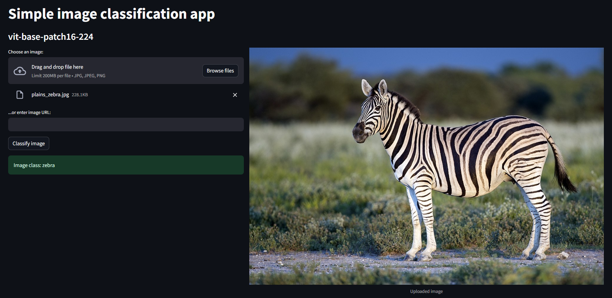

# Simple Image Classification App


This Streamlit app uses the Vision Transformer model [google/vit-base-patch16-224](https://huggingface.co/google/vit-base-patch16-224) from Hugging Face for image classification.

Available online on streamlit: https://simple-image-classification.streamlit.app

## How to run locally
1. Install dependencies:

   ```bash
   pip install -r requirements.txt
2. Run the app:
   ```bash
   streamlit run main.py
3. Access from http://localhost:8501
## Usage

1. **Upload Image**: Click "Choose an image" to upload a JPG, JPEG, or PNG file.

2. **Enter Image URL**: Alternatively, enter the URL of an image in the provided text input.

3. **Classify Image**: Click "Classify image" to initiate classification.

4. **View Results**: Predicted image class is displayed.

## Model Information
   **Model:** `ViT google/vit-base-patch16-224` from Hugging Face.

   **More details:** [Hugging Face Model Hub](https://huggingface.co/google/vit-base-patch16-224)

## Example

